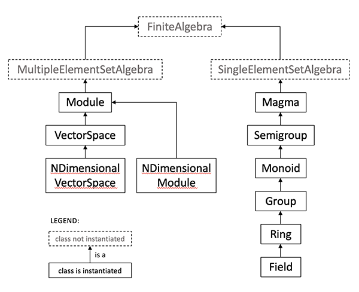

Definitions
===========

The structure and properties of the class hierarchy of the
``finite_algebra`` module are based on the following definitions.

Groups, Rings, Fields, etc.
---------------------------

The following list of algebraic structures is ordered such that each
successive structure builds on the previous one. The class hierarchy of
the ``finite_algebra`` module is modeled on this progression.

-  **Magma** – :math:`\langle S, \circ \rangle`, where :math:`S` is a
   set and :math:`\circ` is a binary operation,
   :math:`\circ: S \times S \to S`

-  **Semigroup** – an associative Magma:
   :math:`\forall a,b,c \in S \Rightarrow a \circ (b \circ c) = (a \circ b) \circ c`

-  **Monoid** – a Semigroup with identity element:
   :math:`\exists e \in S`, such that, for all
   :math:`a \in S, a \circ e = e \circ a = a`

-  **Group** – a Monoid with inverse elements:
   :math:`\forall a \in S, \exists a^{-1} \in S`, such that,
   :math:`a \circ a^{-1} = a^{-1} \circ a = e`

-  **Ring** – :math:`\langle S, +, \cdot \rangle`, where
   :math:`\langle S, + \rangle` is an abelian\ :math:`^\dagger` Group,
   :math:`\langle S, \cdot \rangle` is a Semigroup, and :math:`\cdot`
   distributes\ :math:`^\ddagger` over :math:`+`

-  **Field** – a Ring :math:`\langle S, +, \cdot \rangle`, where
   :math:`\langle S\setminus{\{0\}}, \cdot \rangle` is an abelian
   Group\ :math:`^{\dagger\dagger}`

:math:`^\dagger` An algebra is *abelian* (or *commutative*) for a binary
operation, :math:`\circ`, if :math:`a \circ b = b \circ a` for all
:math:`a,b \in S`.

:math:`^\ddagger` An operation, :math:`\cdot`, *distributes* over
another operation, :math:`+`, if
:math:`a \cdot (b + c) = (a \cdot b) + (a \cdot c)` for all
:math:`a,b,c \in S`.

:math:`^{\dagger\dagger}S\setminus{\{0\}}` is the set :math:`S` with the
additive identity element removed.

**Note**: Although it is possible to have a *trivial Ring*, consisting
of only the additive identity, :math:`S = \{0\}`, it is not possible to
have a *trivial Field*, because we can’t define a Group over the empty
set, :math:`S\setminus{\{0\}} = \emptyset.`

For **Magmas**, **Semigroups**, **Monoids**, and **Groups**, the binary
operation is often referred to as “*multiplication*”, but may sometimes
be called “*addition*”. Also, the identity element may be denoted by
:math:`0` or :math:`1`, rather than :math:`e`, depending on whether the
operation is called *addition* or *multiplication*, resp.

For **Rings** and **Fields**, the two operations, :math:`+` and
:math:`\cdot`, are usually referred to as addition and multiplication,
resp. The identity element for :math:`+` is often denoted by :math:`0`,
and, if a multiplicative identity exists, :math:`1` for :math:`\cdot`.

Regarding a **Ring’s** Semigroup, :math:`\langle S, \cdot \rangle`:

-  if the Semigroup is abelian, then the Ring is called a “*commutative
   Ring*”
-  if the Semigroup is actually a Monoid (i.e., has an identity
   element), then the Ring is called a “*unit Ring*” or “*Ring with
   identity*”

For examples, see the sections **“Groups, Monoids, Semigroups, &
Magmas”** and **“Rings and Fields”**.

Before proceeding, we’ll briefly discuss a motivation for the definition
of a Group.

Group Definition Motivation
~~~~~~~~~~~~~~~~~~~~~~~~~~~

In a nutshell, the definition of a Group,
:math:`G=\langle S, \circ \rangle`, consists of the minimum set of
properties required to methodically solve equations involving the
Group’s elements and its binary operation.

To see this, let :math:`\boxed{a \circ x = b}` be an equation made up of
elements :math:`a,b,x \in S`.

Consider the assumptions required to solve the equation for :math:`x`:

-  First, assume the group’s binary operation is closed; that is,
   :math:`a, b \in S \Rightarrow a \circ b \in S`
-  Assume every element has an inverse; so, multiplying :math:`a^{-1}`
   on both sides yields
   :math:`a^{-1} \circ (a \circ x) = a^{-1} \circ b`
-  Assume the group is associative; therefore
   :math:`(a^{-1} \circ a) \circ x = a^{-1} \circ b`
-  Assume the group has an identity element, :math:`e`; therefore
   :math:`e \circ x = a^{-1} \circ b`
-  And finally, since :math:`e` is an identity element,
   :math:`e \circ x = x \Rightarrow \boxed{x = a^{-1} \circ b}`

The assumptions made above are precisely those that make up the
definition of a Group.

Note that cummutativity was not necessary to solve the equation, and so
it is not required of a Group.

Vector Spaces and Modules
-------------------------

Each type of algebra, described above, has only one set of elements.
Vector Space and Modules, however, are hybrids of two algebras, each
with their own set of elements, called *scalars* and *vectors*. In many
algebra texts, the notation used to describe *multiplication* (or
*addition*) in one component algebra is the same as the notation used
for the other component algebra. Readers are expected to know that the
two implicitely refer to different operations. For a computer program,
however, the difference in operators must be made explicit. For that
reason, care is taken in the definitions below to not conflate the
scalar-scalar, vector-vector, and scalar-vector operations.

A **Vector Space**, :math:`\mathscr{V} = \langle G, F, \circ \rangle`,
consists of the following:

-  an **abelian Group**, :math:`G = \langle V, \oplus \rangle` (i.e.,
   the *“vectors”*)
-  a **field**, :math:`F = \langle S, +, \cdot \rangle` (i.e., the
   *“scalars”*)
-  and a **binary operator**, :math:`\circ : S \times V \to V`

where the following conditions hold:

1. Scaled Vectors: For all :math:`s \in S` and
   :math:`v \in V \Rightarrow s \circ v \in V`
2. Scaling by One: If :math:`1 \in S` is the multiplicative identity
   element of :math:`F`, then :math:`1 \circ v = v`
3. Distributivity of Scalars Over Vector Addition:
   :math:`s \circ (v_1 \oplus v_2) = (s \circ v_1) \oplus (s \circ v_2)`
4. Distributivity of Vectors Over Scalar Addition:
   :math:`(s_1 + s_2) \circ v = (s_1 \circ v) \oplus (s_2 \circ v)`
5. Scalar-Vector Associativity:
   :math:`s_1 \circ (s_2 \circ v) = (s_1 \cdot s_2) \circ v`

A **Module**, :math:`\mathscr{M} = \langle G, R, \circ \rangle`, has the
same conditions as a Vector Space, except that the Field is replaced by
a **Ring**, :math:`R`.

For examples, see the section **“Vector Spaces and Modules”**.

Class Hierarchy
---------------

   Abstract Algebra Class Hierarchy

Note that, a Field is also a Ring, and a Group, and a Monoid, and so on,
since the hierarchy of subclasses of a ``SingleElementSetAlgebra``
extend from each other, as shown above. A similar situation holds for a
``MultipleElementSetAlgebra``: a VectorSpace is a Module. And, since
inheritance “flows” against the arrows of the figure above, a method
that may be usually associated with a particular class might actually be
defined in its parent class, or one of its ancestor classes.

For example, the method, ``is_commutative``, answers a question we often
ask of Groups, but to answer it only requires that there be a binary
operation that can be used to check it. So, ``is_commutative`` is
defined for Magma. But, since Magma methods and properties are inherited
by all classes that extend from Magma (from Semigroup to Field),
``is_commutative`` applies to them also. Similar for ``is_associative``,
``identity``, ``inv``, ``center``, ``isomorphic``, etc.

Another example is given by *units*, which are usually associated with
Rings. But the only property an algebra requires to be able to identify
*units*, is that of having an identity element. Identity elements first
appear in the class hierarchy in Monoids, so the method, ``units``, is
defined for Monoids, and then inherits down through its subclasses. That
is, units can be identified for Monoids, Groups, Rings, and Fields. Of
course, the concept of units is not that interesting for Groups, since
every element of a Group is a unit, but they are interesting in Monoids,
and, under multiplication, in Rings. The ``unit`` method for Rings
applies only to the multiplicative operation and multiplicative identity
element, if it exists.

Direct Products
---------------

This section provides the usual definition of a direct product for
Magmas through Fields, plus an alternative definition for Rings &
Fields, referred to here as “squaring” the Ring or Field. By squaring a
field, of the right order, one can obtain another field, unlike taking a
direct product of a field with itself, which always yields a ring. More
on this below in the subsection, “Squaring a Field to Obtain a Field”.

Like Vector Spaces, Direct Products involve the combination of possibly
different algebras, with different sets of elements and different binary
operations. As previously noted, in many algebra texts, the notation
used to describe multiplication (or addition) in one component algebra
is the same as the notation used for the other component algebra.
Readers are expected to know that the two implicitely refer to different
operations. For a computer program, however, the difference in operators
must be made explicit. For that reason, care is taken in the definitions
below to not conflate the operations.

If :math:`G = \langle S, + \rangle` and
:math:`H = \langle T, \oplus \rangle` are two Groups, then their
**direct product**, denoted by :math:`G \times H`, is also a Group,
where

-  :math:`G \times H \equiv \langle U, \bullet \rangle`
-  :math:`U = \{(g,h): g \in S, h \in T\}`
-  :math:`(g, h) \bullet (g', h') = (g + g', h \oplus h')` for all
   :math:`(g, h), (g', h') \in U`

If :math:`R_1 = \langle S, +, \cdot \rangle` and
:math:`R_2 = \langle T, \oplus, \odot \rangle` are two Rings, then their
**direct product**, denoted by :math:`R_1 \times R_2`, is also a Ring,
where

-  :math:`R_1 \times R_2 \equiv \langle U, \circ, \bullet \rangle`
-  :math:`U = \{(s, t): s \in S, t \in T\}`
-  :math:`(s, t) \circ (s', t') = (s + s', t \oplus t')`, for all
   :math:`(s, t), (s', t') \in U`
-  :math:`(s, t) \bullet (s', t') = (s \cdot s', t \odot t')`

Since the only requirement needed to form a direct product is that there
be two *algebras*, each with its own set of elements and binary
operation(s), the direct product definition works for any
``SingleElementSetAlgebra`` (Magma through Field). So, if ``G`` and
``H`` are two *SingleElementSetAlgebras*, then their direct product can
be obtained by multiplying the two objects using Python’s multiplication
operator, ``G * H``.

Squaring the Ring
~~~~~~~~~~~~~~~~~

(pun intended)

An opportunity to define an alternative type of direct product presents
itself when we consider the direct product of a ring,
:math:`R = \langle S, +, \cdot \rangle`, with itself, which will be
denoted here as :math:`R^2`. In this case, addition is defined the same
as for the usual direct product, but multiplication is defined to be
similar to that used for complex numbers, as shown below:

-  :math:`R^2 \equiv \langle V, \circ, \otimes \rangle`
-  :math:`V = \{(s, t): s, t \in S\}`
-  :math:`(s, t) \circ (s', t') = (s + s', t + t')`, for all
   :math:`(s, t), (s', t') \in V`
-  :math:`(s, t) \otimes (s', t') = (s \cdot s' - t \cdot t', s \cdot t' + s' \cdot t)`,
   where, of course, “:math:`-`” denotes addition by the additive
   inverse

``Ring`` and ``Field`` objects in ``finite_algebras`` can be squared
using the Ring method, ``sqr()``.

Squaring a Field to Obtain a Field
~~~~~~~~~~~~~~~~~~~~~~~~~~~~~~~~~~

Where the definition of squaring a Ring, above, gets interesting though,
is when we square a finite Field, :math:`F_n`. :math:`{F_n}^2` won’t
always be a Ring; sometimes it will be a Field. Specifically,
:math:`{F_n}^2` will be a field if :math:`n` is a **Gaussian prime**,
that is, a prime number of the form, :math:`n=4k+3`, (e.g.,
:math:`3, 7, 11, 19, 23, 31, 43, ...`). Otherwise, :math:`{F_n}^2` will
be a Ring.

Properties of Algebras
----------------------

This section provides definitions of related algebraic structures and
properties.

Center
~~~~~~

The **center** of an algebra is usually defined for Groups, however
since the definition only requires a set and a binary operation, it has
been extended here to apply to Magmas, and so applies to all
*SingleElementSetAlgebras*.

The **center** of a Magma is the subset of elements of the Magma that
commute with every element in the Magma.

That is, :math:`C \subseteq S` is the center of the Magma,
:math:`\langle S, \circ \rangle`, if
:math:`c \in C \Rightarrow \forall x \in S, c \circ x = x \circ c.` (see
Pinter’s book, chapter 5, exercise D3)

Note also, the center of a commutative algebra is the entire algebra.
The gist of Pinter’s exercise is that, for Groups, the center is closed
and hence defines a subgroup. The proof of this follows easily from
associativity and the commutative property of center elements, so it
will also be true for Semigroups, but not necessarily true for Magmas.

There are two Magma methods related to the center:

-  ``center`` returns the center of a Magma, or it returns an empty list
   if the center is empty
-  ``center_algebra`` returns the algebra defined by the center, if the
   center exists and is closed, otherwise it returns ``None``.

Commutators
~~~~~~~~~~~

Let :math:`G = \langle S, \circ \rangle` be a Group, then for any pair
of elements, :math:`a, b \in S`, the product,
:math:`a \circ b \circ a^{-1} \circ b^{-1}`, denoted :math:`[a,b]`, is
called a **commutator** of the Group.

Note that :math:`a \circ b \circ a^{-1} \circ b^{-1} = e` if and only if
:math:`ab = ba`. The following quote helps explain the motivation behind
the definition of commutators:

   “Thus, in an abelian group all the commutators are equal to e. In a
   group which is not abelian, the number of distinct commutators may be
   regarded as a measure of the extent to which G departs from being
   commutative. (The fewer the commutators, the closer the group is to
   being an abelian group.)” – [Pinter 1982]

If :math:`G` is abelian, then the identity element, :math:`e`, is the
only commutator in :math:`G`, because :math:`[a,b] = e` for all possible
:math:`a,b \in S`.

So, if :math:`G` is non-abelian, then for some :math:`a,b \in S`, we
have :math:`[a,b] = c \ne e`.

The set of all commutators of a Group is a subgroup, and is called the
**Commutator Subgroup**.

The following methods exist for ``Group`` instances:

-  ``commutator``, for two elements, :math:`a,b`, this method will
   return :math:`[a,b]`
-  ``commutators``, will return a list of all the commutators of a Group
-  ``commutator_subalgebra``, will return the commutator subgroup of a
   Group

For a Ring, :math:`R = \langle S, +, \cdot \rangle`, the elements under
addition, :math:`\langle S, + \rangle` are, by definition, an abelian
Group, so commutators for a Ring’s elements are defined using
multiplication instead. But, :math:`\langle S, \cdot \rangle` is a
Semigroup, or at best, a Monoid, which means that we can’t use inverses
in the definition of a Ring’s commutator. Consequently, **Ring
commutators** are defined to be elements of the form,
:math:`(a \cdot b) - (b \cdot a)`, and are also denoted by
:math:`[a, b]`.

The Ring methods, ``commutator``, ``commutators``, and
``commutator_subalgebra``, use the Ring definition of a commutator.

There is currently no method to produce a *commutator subring*. (See
Eroǧlu, Münevver Pınar. “On the subring generated by commutators.”
Journal of Algebra and Its Applications (2020): 2250059.)

Units of a Ring
~~~~~~~~~~~~~~~

Let :math:`R = \langle S, +, \cdot \rangle` be a *Ring with identity*
(or *Unit Ring*),

then :math:`x \in S` is a **unit** if :math:`x \cdot y = 1` and
:math:`y \cdot x = 1` for some :math:`y \in S`.

The set of all units of :math:`R` are denoted by :math:`S^\times` and
form an abelian Group under multiplication,
:math:`R^\times = \langle S^\times, \cdot \rangle`, called the **Units
Subgroup** of :math:`R`.

The method, ``units``, will return the units of a Ring as a list of
element names, or optionally, element indices. And, since the only
requirement for an algebra to have units is that it have an identity
element, the ``units`` method also works for Monoids.

The method, ``units_subgroup``, will return the units subgroup of a Ring
(or Monoid).

Division Algebra
~~~~~~~~~~~~~~~~

**[NOTE: Need good references for divisibility and cancellation]**

A Magma, :math:`M = \langle S, \circ \rangle` is a **division Algebra**
if :math:`\forall a,b \in S, \exists x,y \in S` such that
:math:`a \circ x = b` and :math:`y \circ a = b`.

This property is trivially true for Groups.

The Magma method, ``is_division_algebra``, tests for this property.

Regularity in Semigroups
~~~~~~~~~~~~~~~~~~~~~~~~

A Semigroup, :math:`\langle S, \circ \rangle` is **regular** if for each
:math:`a \in S, \exists \bar{a} \in S` such that
:math:`a \circ \bar{a} \circ a = a`.

The element :math:`\bar{a}` is called a **weak inverse** of :math:`a`. A
weak inverse may not exist or there may be more than one for any
particular element. If the algebra is regular, then there will be at
least 1 weak inverse for each element, otherwise some elements may not
have a weak inverse.

See the paper, `“Why Study Semigroups” by John M.
Howie <http://www.thebookshelf.auckland.ac.nz/docs/Maths/PDF2/mathschron016-001.pdf>`__

Here are some Semigroup methods related to regularity:

-  ``is_regular`` returns True or False, depending on whether the
   Semigroup is regular
-  ``weak_inverses`` returns a dictionary of weak inverses, where each
   key is one of the algebra’s elements and its value is a list of its
   weak inverses.
